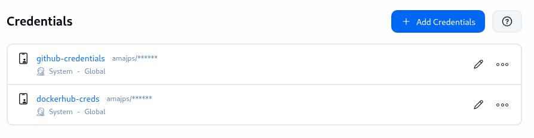
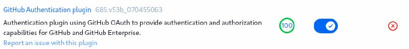

# Данный проект посвящен DevSecOps и jenkins

Данный проект реализует полный DevSecOps pipeline для веб-приложения с использованием:

- CI/CD: Jenkins
- SAST: Semgrep
- SCA: OWASP Dependency Check
- Container Scanning: Trivy
- DAST: OWASP ZAP
- Containerization: Docker
- Orchestration: Kubernetes (Minikube)

Pipeline выполняет полный цикл:

```
Code → Scan → Build → Scan → Push → Deploy → DAST
```

---

# Требования

- Linux (Kali / Ubuntu)
- Docker
- Jenkins
- kubectl
- Minikube

Для того чтобы установить docker,  kubernetes, minikube, jenkins можно следовать мануалам установки

```
https://docs.docker.com/engine/install/
https://www.kali.org/docs/containers/installing-docker-on-kali/ #Если у вас kali
https://kubernetes.io/docs/tasks/tools/install-kubectl-linux/
https://minikube.sigs.k8s.io/docs/start/?arch=%2Flinux%2Fx86-64%2Fstable%2Fbinary+download
https://www.jenkins.io/doc/book/installing/linux/
```
Из-за того что PSP depricated, minikikube нужно запускать со следующими параметрами
```
sudo swapoff -a
minikube start   --kubernetes-version=v1.23.17  --driver=docker   --extra-config=apiserver.enable-admission-plugins=PodSecurityPolicy  --addons=pod-security-policy
```
Чтобы скопировать репозиторий:
```
git clone https://github.com/amajps/gazpromtest.git
```

### Jenkins

Что бы запустить проект, а именно пайплайн, нужно зайти в jenkins по ссылке http://localhost:8080, После того как вы установили Jenkins по мануалу, нужно Unlock jenkins перейти в
```
sudo cat /var/lib/jenkins/secrets/initialAdminPassword
```
, но бдите, пароль будет выведен в консоли. После того как вы вставили нужно будет выбрать **Install suggested plugins**, потом добавить Учетные Записи 

github-credentials для доступа к github
dockerhub-creds для push образа в репозиторий

---
потом нужно установить GitHub Authentification plugin **Manage Jenkins** > **Plugin**

---
**Важно** сделать следующие шаги c включенным minikube для того чтобы пустить Jenkins в 

```
# Шаг 1
sudo mkdir -p /var/lib/jenkins/.kube
sudo cp ~/.kube/config /var/lib/jenkins/.kube/config

# Шаг 2 - копируем сертификаты ДО изменения config
sudo cp -r /home/kali/.minikube /var/lib/jenkins/
sudo chown -R jenkins:jenkins /var/lib/jenkins/.minikube

# Шаг 3 - правим config
sudo nano /var/lib/jenkins/.kube/config
# Заменить пути на:
# client-certificate: /var/lib/jenkins/.minikube/profiles/minikube/client.crt
# client-key: /var/lib/jenkins/.minikube/profiles/minikube/client.key
# certificate-authority: /var/lib/jenkins/.minikube/ca.crt

# Шаг 4 - финальные права
sudo chown -R jenkins:jenkins /var/lib/jenkins/.kube
```
## После всего того что описано выше

Можно запускать пайплайн, для этого перейдите **New Item** > **Pipleine** и назовите его, дальше перейдите на **Configure** и вставьте код из Jenkinsfile если хотите проверить результат **задания 1**, и k8s/Jenkinsfile чтобы проверить результат **задания 2**
результаты сканирования будут храниться в 
```
/var/lib/jenkins/jobs/<Имя_пайлайна>/builds/<Итерация/попытка_запуска>/archive/security-report
```

## Ссылка на репозиторий на образ
```
https://hub.docker.com/repository/docker/amajps/vuln-app/general
```
# Troubleshooting

Если у вас не возникла ошибка на этапе SCA с [INFO] NVD API has 345,268 records in this update (конкретно не подгружается база уязвимостей), то попробуйте с VPN, если не получится то закомментируйте, я не понял в чем дело. При перепроверке 20.04.2026 SCA очень долго загружался или не загружался вообще
